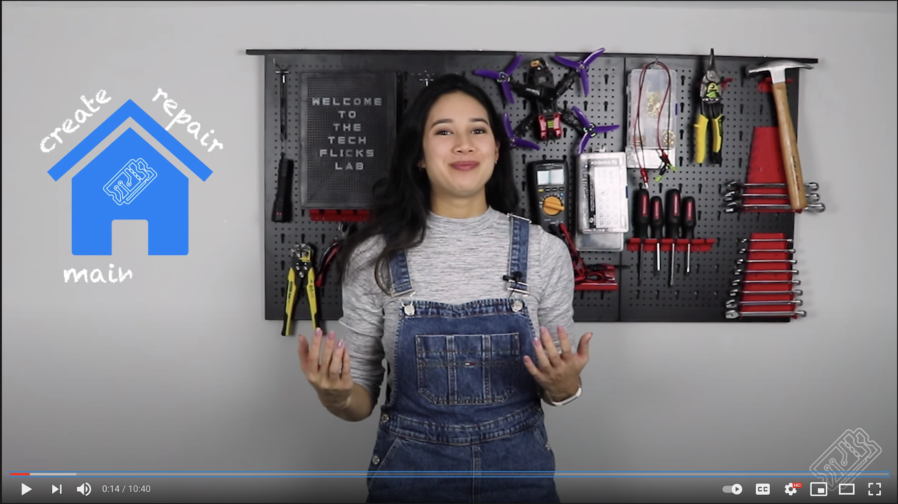

# [T3chFlicks](https://t3chflicks.org): Home Lab
> How to set up a home lab for making electronics, computers, and 3D printing

--- 

## `tutorials`

 

---

This project was created by [T3chFlicks](https://t3chflicks.org) - A tech focused education and services company.

---